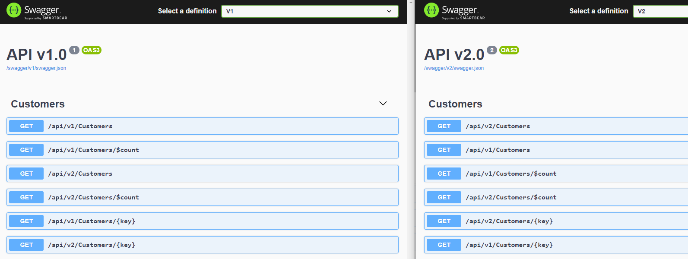

# ASP.NET Core OData (8.x) API Versioning Sample

---
This is the project repository for post at: https://devblogs.microsoft.com/odata/api-versioning-extension-with-asp-net-core-odata-8/

For details, please refer to the post.

## Update 3/21/2021

This is copy of https://github.com/xuzhg/MyAspNetCore/tree/master/src/ODataApiVersion

### Upgrades
- Requires VS 2022
- .NET 6
- Microsoft.AspNetCore.OData 8.0.8
- Swashbuckle.AspNetCore 6.3.0

### Issues

1. Swagger v1 and v2 show both controllers for each API version.



2. `\$odata` debug page shows duplicate endpoint mappings.


3. Swagger v1 executes v1 controller; however, `$select`, `$orderby`, etc. query parameters are missing from Swagger doc although present in OData 7.x.


4. Controllers require additional attributes to show in Swagger docs at all (`ApiController` and `Route`).
```
[ApiController]
[ApiVersion("1.0")]
[Route("api/v{version:apiVersion}/[controller]")]
public class CustomersController : ODataController
```

## Update at 12/21/2021

Enable OpenAPI/Swagger via customer requirement.

### OpenAPI/Swagger

If you run the sample and send the following request in a Web brower:

`/swagger`, you will get the following (similar) swagger page:


